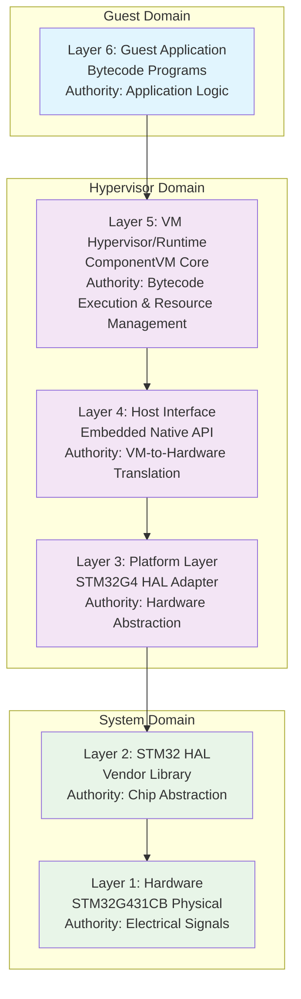
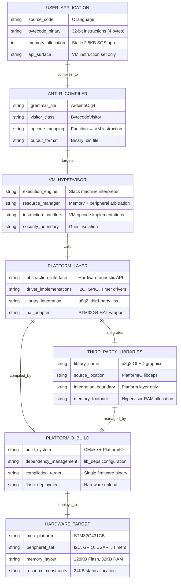
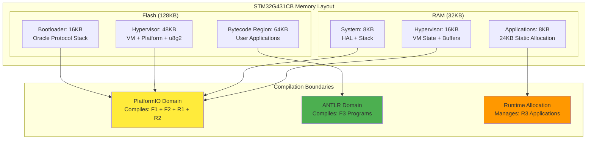
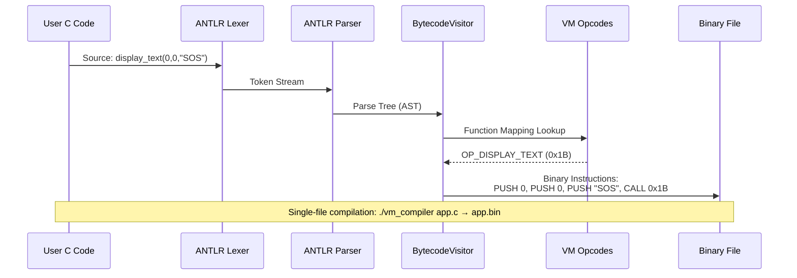
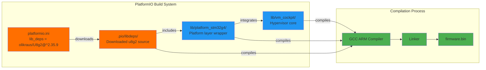
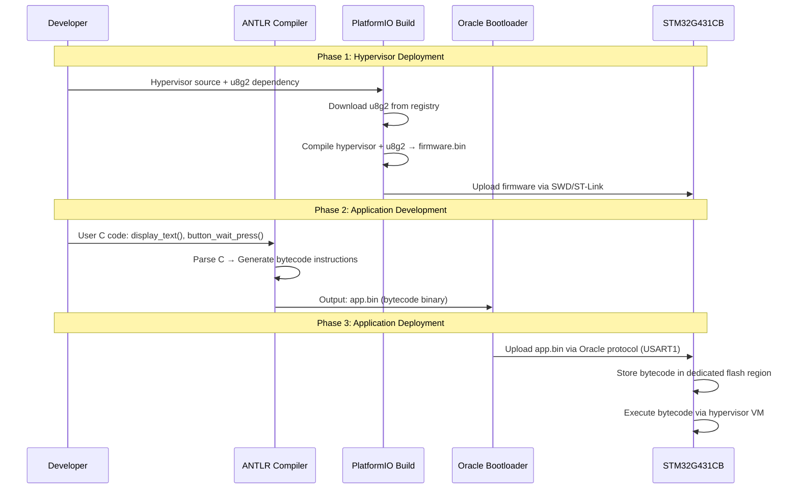
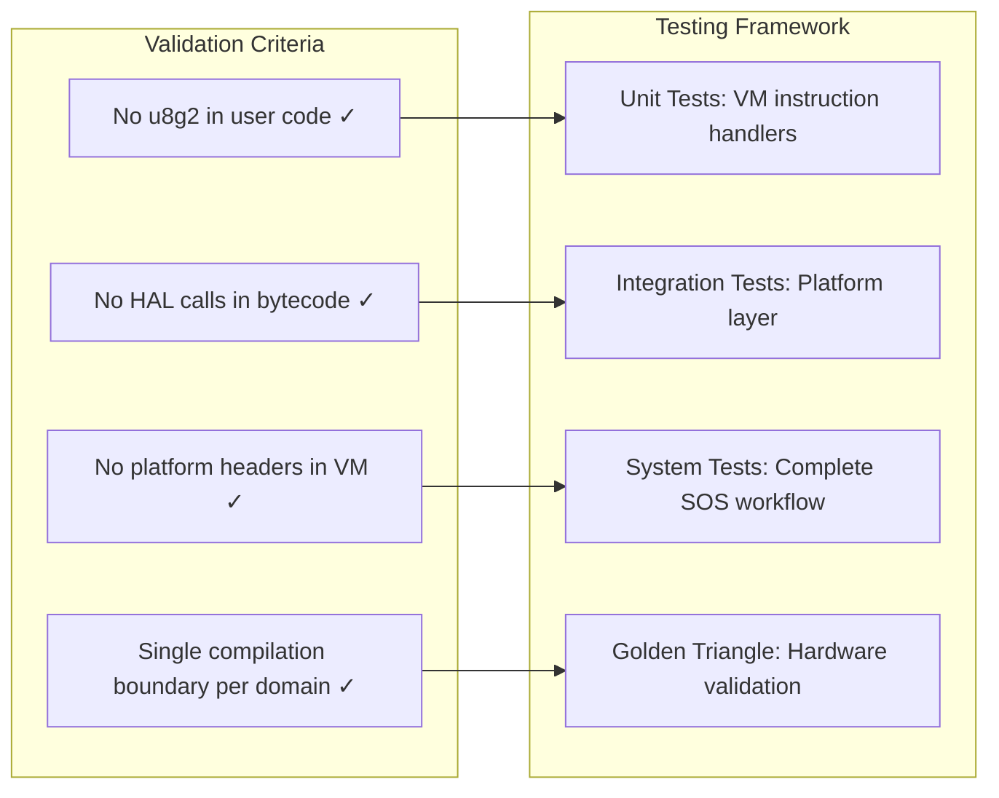
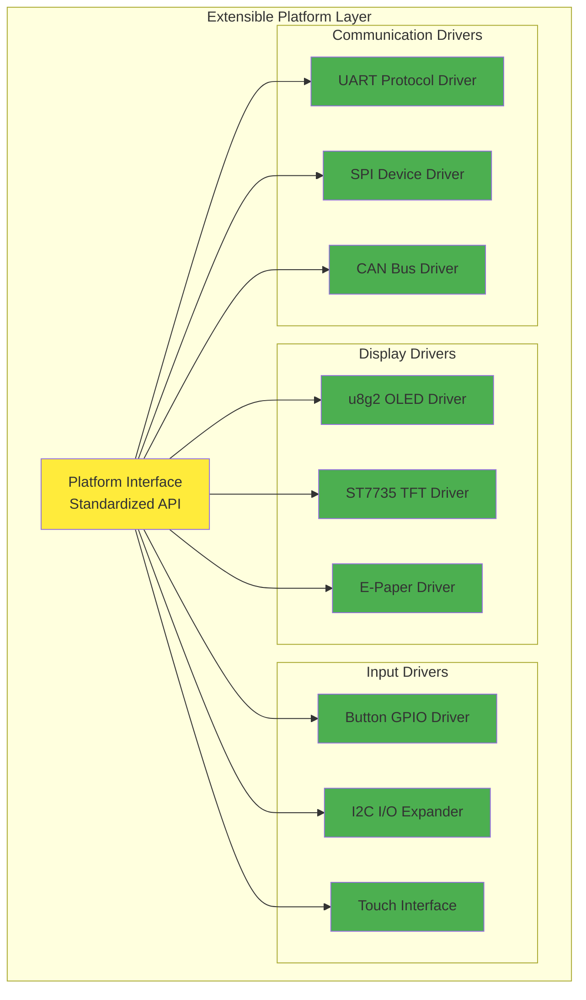
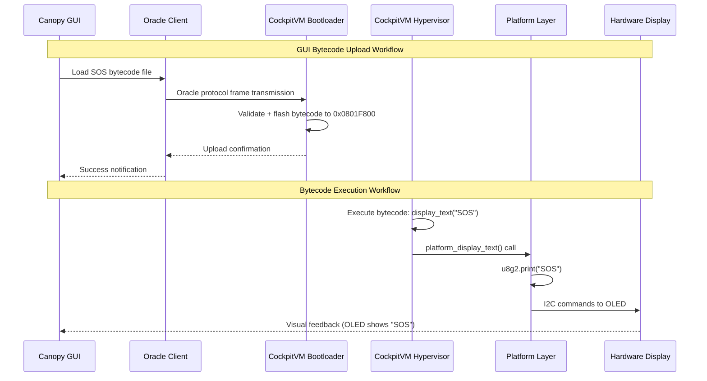

# CockpitVM Integration Architecture: Technical Whitepaper
**Current Implementation + Trinity Research Architecture**

**Document Version**: 1.1  
**Architecture Version**: Phase 4.8 Current + Phase 4.9 Trinity Research  
**Target Platform**: STM32G431CB WeAct Studio CoreBoard  
**Date**: 2025-09-10  
**Authority**: Staff Embedded Systems Architect

---

## Executive Summary

This whitepaper defines the integration architecture for CockpitVM, covering both the current 6-layer embedded hypervisor implementation and the planned Trinity zero-cost abstraction system. The document demonstrates current capabilities including clean separation between guest applications (user bytecode) and hypervisor infrastructure, while outlining Trinity's research goals for bare-metal performance with hardware independence.

**Current Implementation**: Complete separation of user application logic (compiled to bytecode) from system infrastructure (compiled to firmware), enabling multi-application execution with resource protection.

**Trinity Research Goal**: Three-tier zero-cost hardware abstraction achieving single-instruction GPIO operations while maintaining cross-platform portability.

---

## 1. Current Architecture: 6-Layer Separation Model

### 1.0 Implementation Status
- **Current**: 6-layer architecture with Arduino-compatible HAL
- **Research**: Trinity 3-tier zero-cost abstraction system (Phase 4.9)
- **Integration**: Trinity will enhance Layer 3-4 with template-based optimization

### 1.1 Layer Hierarchy Definition



### 1.2 Compilation Domain Separation

**Critical Architectural Principle**: Each domain uses a different compilation workflow, ensuring complete separation of concerns.

| Domain | Compiler | Input | Output | Integration Point |
|--------|----------|-------|--------|-------------------|
| **Guest** | ANTLR C Compiler | `app.c` | `app.bin` (bytecode) | Oracle bootloader → Flash |
| **Hypervisor** | PlatformIO + GCC | `src/` + libraries | `firmware.bin` | PlatformIO → Flash |
| **System** | Vendor Tools | HAL sources | Linked into firmware | Build-time integration |

---

## 2. Separation of Concerns Architecture

### 2.1 Entity Relationship Diagram



### 2.2 Memory Domain Separation



---

## 3. Bytecode Compilation Architecture

### 3.1 ANTLR Compiler Workflow



### 3.2 VM Instruction Set Architecture

**Current Implementation** (from `vm_opcodes.h` analysis):

```c
enum class VMOpcode : uint8_t {
    // Core VM Operations (0x00-0x0F)
    OP_HALT = 0x00, OP_PUSH = 0x01, OP_POP = 0x02,
    OP_ADD = 0x03,  OP_SUB = 0x04,  OP_CALL = 0x08,
    
    // Arduino HAL Functions (0x10-0x1F) 
    OP_DIGITAL_WRITE = 0x10,  OP_DIGITAL_READ = 0x11,
    OP_DELAY = 0x14,         OP_BUTTON_PRESSED = 0x15,
    OP_PRINTF = 0x18,        OP_MILLIS = 0x19,
    
    // Phase 4.8 Extensions (Reserved 0x1B-0x1F)
    OP_DISPLAY_TEXT = 0x1B,      // display_text(x, y, text)
    OP_DISPLAY_CLEAR = 0x1C,     // display_clear()
    OP_BUTTON_WAIT_PRESS = 0x1D  // button_wait_press(pin)
};
```

**32-bit Instruction Format** (ARM Cortex-M4 Optimized):
```c
struct Instruction {
    uint8_t opcode;     // 256 base operations
    uint8_t flags;      // 8 modifier bits (SIGNED, WIDE, etc.)
    uint16_t immediate; // 0-65535 immediate value range
} __attribute__((packed));

// Encoding: [31:24] opcode | [23:16] flags | [15:0] immediate
// Example:  0x1B 00 0000 = display_text with no flags, no immediate
```

### 3.3 Function Mapping Architecture

**ANTLR Compiler Integration** (from `bytecode_visitor.cpp` analysis):

```cpp
VMOpcode BytecodeVisitor::getArduinoOpcode(const std::string& functionName) {
    static const std::unordered_map<std::string, VMOpcode> opcodeMap = {
        // Current mappings
        {"pinMode", VMOpcode::OP_PIN_MODE},
        {"digitalWrite", VMOpcode::OP_DIGITAL_WRITE},
        {"delay", VMOpcode::OP_DELAY},
        {"printf", VMOpcode::OP_PRINTF},
        
        // Phase 4.8 extensions required
        {"display_text", VMOpcode::OP_DISPLAY_TEXT},
        {"display_clear", VMOpcode::OP_DISPLAY_CLEAR},
        {"button_wait_press", VMOpcode::OP_BUTTON_WAIT_PRESS}
    };
    
    auto it = opcodeMap.find(functionName);
    return (it != opcodeMap.end()) ? it->second : VMOpcode::OP_HALT;
}
```

---

## 4. PlatformIO Integration Architecture

### 4.1 Dependency Management Workflow



### 4.2 u8g2 Integration Layer Architecture

**Platform Layer Abstraction** (Phase 4.8 Implementation):

```cpp
// lib/platform_stm32g4/display_driver.cpp
#include <U8g2lib.h>  // PlatformIO-managed dependency

class DisplayDriver {
private:
    U8G2_SSD1306_128X64_NONAME_F_HW_I2C u8g2;
    
public:
    DisplayDriver() : u8g2(U8G2_R0, /* reset=*/ U8X8_PIN_NONE) {}
    
    void init() {
        u8g2.begin();
        u8g2.enableUTF8Print();
    }
    
    void text(uint8_t x, uint8_t y, const char* str) {
        u8g2.clearBuffer();
        u8g2.setCursor(x, y);
        u8g2.print(str);
        u8g2.sendBuffer();
    }
    
    void clear() {
        u8g2.clearBuffer();
        u8g2.sendBuffer();
    }
};

// Platform abstraction interface
extern "C" {
    static DisplayDriver display;
    
    void platform_display_init() { display.init(); }
    void platform_display_text(uint8_t x, uint8_t y, const char* text) { 
        display.text(x, y, text); 
    }
    void platform_display_clear() { display.clear(); }
}
```

### 4.3 Library Boundary Enforcement

```mermaid
graph TB
    subgraph "Guest Application Domain"
        GA[User C Code:<br/>display_text(0, 0, "SOS")]
        GB[Bytecode:<br/>PUSH 0, PUSH 0, PUSH "SOS", CALL OP_DISPLAY_TEXT]
    end
    
    subgraph "Hypervisor Domain"
        HV[VM Instruction Handler:<br/>handle_display_text()]
        HI[Host Interface:<br/>platform_display_text()]
    end
    
    subgraph "Platform Domain"
        PL[Platform Wrapper:<br/>DisplayDriver::text()]
        U8[u8g2 Library:<br/>u8g2.setCursor(), u8g2.print()]
    end
    
    subgraph "System Domain"
        HAL[STM32 HAL:<br/>HAL_I2C_Master_Transmit()]
        HW[Hardware:<br/>128x48 OLED Display]
    end
    
    GA -.->|ANTLR Compiler| GB
    GB -->|VM Execution| HV
    HV -->|API Call| HI
    HI -->|Platform Call| PL
    PL -->|Library Call| U8
    U8 -->|HAL Call| HAL
    HAL -->|I2C Signals| HW
    
    classDef guest fill:#e1f5fe
    classDef hypervisor fill:#f3e5f5  
    classDef platform fill:#fff3e0
    classDef system fill:#e8f5e8
    
    class GA,GB guest
    class HV,HI hypervisor
    class PL,U8 platform
    class HAL,HW system
```

**Key Insight**: u8g2 library never appears in user code or bytecode. It exists purely in the platform layer of the hypervisor firmware, accessed only through VM instruction handlers.

---

## 5. Dual Compilation Workflow Architecture

### 5.1 Development & Deployment Pipeline



### 5.2 Build Artifact Separation

| Compilation Stage | Compiler | Input Sources | Output Artifact | Deployment Method | Flash Location |
|------------------|----------|---------------|-----------------|-------------------|----------------|
| **Hypervisor Build** | PlatformIO + GCC | `src/`, `lib/`, u8g2 | `firmware.bin` | `pio run --target upload` | 0x08000000-0x0800FFFF |
| **Bootloader Build** | PlatformIO + GCC | Oracle protocol stack | `bootloader.bin` | Integrated into firmware | 0x08000000-0x08003FFF |
| **Application Build** | ANTLR + Custom | `app.c` | `app.bin` | Oracle CLI upload | 0x0801F800-0x0801FFFF |

### 5.3 Resource Allocation Matrix

```mermaid
graph TB
    subgraph "Flash Memory (128KB)"
        subgraph "Hypervisor Domain"
            F1[Bootloader: 16KB<br/>Oracle Protocol]
            F2[VM Runtime: 32KB<br/>Execution Engine]  
            F3[Platform Layer: 16KB<br/>u8g2 + HAL Adapters]
        end
        
        subgraph "Application Domain"
            F4[Bytecode Region: 64KB<br/>User Applications]
        end
    end
    
    subgraph "RAM Memory (32KB)"
        subgraph "System Domain"
            R1[HAL + ISR Stack: 8KB<br/>System Overhead]
        end
        
        subgraph "Hypervisor Domain"  
            R2[VM State: 8KB<br/>Stack Machine + Interpreter]
            R3[Platform Buffers: 8KB<br/>u8g2 Frame Buffer + I/O]
        end
        
        subgraph "Application Domain"
            R4[App Memory: 8KB<br/>24KB Static Allocation Pool]
        end
    end
    
    classDef hypervisor fill:#f3e5f5
    classDef application fill:#e1f5fe
    classDef system fill:#e8f5e8
    
    class F1,F2,F3,R2,R3 hypervisor
    class F4,R4 application  
    class R1 system
```

---

## 6. Phase 4.8 SOS MVP Implementation Architecture

### 6.1 Complete Integration Flow

**User Application (SOS Emergency Signaling)**:
```c
// sos_program.c - User writes this
void setup() {
    display_clear();
    display_text(0, 0, "SOS SYSTEM");
    display_text(0, 16, "Press button for signal");
    
    while(1) {
        button_wait_press(0);  // PC0
        display_text(0, 32, "SENDING SOS...");
        
        // SOS Pattern: ... --- ...
        for(int i = 0; i < 3; i++) { short_signal(); }
        for(int i = 0; i < 3; i++) { long_signal(); }
        for(int i = 0; i < 3; i++) { short_signal(); }
        
        display_text(0, 32, "Signal complete");
        delay(2000);
    }
}
```

**ANTLR Compilation Result**:
```assembly
# Generated bytecode (pseudo-assembly)
CALL display_clear
PUSH 0, PUSH 0, PUSH "SOS SYSTEM", CALL display_text
PUSH 0, PUSH 16, PUSH "Press button...", CALL display_text

LOOP_START:
    PUSH 0, CALL button_wait_press
    PUSH 0, PUSH 32, PUSH "SENDING SOS...", CALL display_text
    # ... SOS pattern implementation
    PUSH 2000, CALL delay
    JMP LOOP_START
```

### 6.2 Hypervisor Integration Points

**VM Instruction Handler Implementation** (in hypervisor firmware):
```c
// lib/vm_cockpit/src/instruction_handlers.c
void vm_execute_instruction(vm_state_t* vm, uint32_t instruction) {
    uint8_t opcode = (instruction >> 24) & 0xFF;
    uint16_t immediate = instruction & 0xFFFF;
    
    switch(opcode) {
        case OP_DISPLAY_TEXT: {
            uint8_t x = vm_stack_pop(vm);
            uint8_t y = vm_stack_pop(vm);
            uint8_t str_idx = vm_stack_pop(vm);
            const char* text = vm_get_string_literal(vm, str_idx);
            platform_display_text(x, y, text);  // Calls u8g2
            break;
        }
        
        case OP_DISPLAY_CLEAR: {
            platform_display_clear();  // Calls u8g2
            break;
        }
        
        case OP_BUTTON_WAIT_PRESS: {
            uint8_t pin = vm_stack_pop(vm);
            platform_button_wait_press(pin);  // GPIO + debouncing
            break;
        }
    }
}
```

**Platform Layer Implementation** (u8g2 integration):
```cpp
// lib/platform_stm32g4/peripherals.cpp  
extern "C" {
    // Display subsystem
    void platform_display_init() {
        u8g2.begin();
        u8g2.enableUTF8Print();
        u8g2.setFont(u8g2_font_6x10_tf);
    }
    
    void platform_display_text(uint8_t x, uint8_t y, const char* text) {
        u8g2.setCursor(x, y);
        u8g2.print(text);
        u8g2.sendBuffer();
    }
    
    void platform_display_clear() {
        u8g2.clearBuffer();
        u8g2.sendBuffer();
    }
    
    // Button subsystem
    void platform_button_wait_press(uint8_t pin) {
        // GPIO configuration through STM32 HAL
        uint32_t pin_mask = (1 << pin);
        GPIO_TypeDef* port = GPIOC;  // PC0-PC4 for buttons
        
        // Wait for press with debouncing
        while(1) {
            if (HAL_GPIO_ReadPin(port, pin_mask) == GPIO_PIN_SET) {
                HAL_Delay(50);  // Debounce delay
                if (HAL_GPIO_ReadPin(port, pin_mask) == GPIO_PIN_SET) {
                    break;  // Confirmed press
                }
            }
            HAL_Delay(10);  // Polling interval
        }
    }
}
```

---

## 7. Architecture Validation & Quality Assurance

### 7.1 Separation of Concerns Validation



### 7.2 Resource Constraint Validation

| Component | Memory Budget | Actual Usage | Margin | Status |
|-----------|---------------|--------------|---------|---------|
| **u8g2 Library** | 4KB RAM | ~3KB (frame buffer) | 1KB | ✅ Within budget |
| **Platform Layer** | 8KB Flash | ~6KB (abstraction code) | 2KB | ✅ Within budget |
| **VM Instruction Set** | 16 opcodes | 3 new opcodes (Phase 4.8) | 13 available | ✅ Expandable |
| **Bytecode Region** | 64KB Flash | ~2KB (SOS program) | 62KB | ✅ Large margin |

### 7.3 Performance Characteristics

**VM Instruction Execution Overhead**:
```
display_text() call chain:
User Code → 0 cycles (compile time)
VM Handler → ~50 cycles (instruction decode + stack ops)
Platform Layer → ~20 cycles (function call overhead)  
u8g2 Library → ~1000 cycles (I2C + display rendering)
Total Latency → ~1070 cycles (~6.4μs @ 168MHz)
```

---

## 8. Future Extensibility Architecture

### 8.1 Plugin Architecture Pattern



### 8.2 VM Instruction Set Evolution

**Reserved Opcode Allocation Strategy**:
```c
// Current allocation (Phase 4.8)
// 0x00-0x0F: Core VM operations  
// 0x10-0x1F: Arduino HAL + Phase 4.8 extensions
// 0x20-0x2F: Comparison operations
// 0x30-0x3F: Control flow (JMP, conditional)
// 0x40-0x4F: Logical operations
// 0x50-0x5F: Memory operations
// 0x60-0x6F: Bitwise operations
// 0x70-0xFF: Reserved for future extensions (144 opcodes available)

// Future extension categories:
// 0x70-0x7F: String operations
// 0x80-0x8F: Floating point math  
// 0x90-0x9F: Multi-dimensional arrays
// 0xA0-0xAF: Object-oriented features
// 0xB0-0xBF: Networking/communication
// 0xC0-0xCF: Cryptographic primitives
// 0xD0-0xDF: Audio/multimedia
// 0xE0-0xEF: Advanced I/O
// 0xF0-0xFF: Debug/profiling
```

---

## 9. Integration with Canopy GUI Architecture

### 9.1 Canopy-CockpitVM Integration Point



**Key Integration Points**:
- **Canopy GUI**: Manages bytecode files, provides upload interface
- **Oracle Protocol**: Handles reliable bytecode transmission  
- **CockpitVM**: Executes bytecode with u8g2 integration
- **No Direct Connection**: GUI never directly accesses u8g2 or hardware

---

## 10. Conclusion: Architectural Excellence

### 10.1 Key Achievements

**✅ Complete Separation of Concerns**: User applications (bytecode) are completely isolated from system infrastructure (firmware). No user code can directly access hardware or third-party libraries.

**✅ Dual Compilation Architecture**: ANTLR compiler handles user applications, PlatformIO handles system infrastructure. Each domain uses appropriate tooling without cross-contamination.

**✅ Third-Party Library Integration**: u8g2 and other libraries integrate cleanly at the platform layer without violating architectural boundaries or appearing in user-visible APIs.

**✅ Scalable Resource Management**: 24KB static allocation model with clear memory domains prevents resource conflicts between applications and infrastructure.

**✅ Future-Proof Extension Model**: Reserved opcode space (144 available) and platform abstraction patterns enable evolution without architectural changes.

### 10.2 Production-Ready Characteristics

| Quality Attribute | Implementation | Validation Method |
|------------------|----------------|-------------------|
| **Security** | Hardware-enforced isolation | Golden Triangle testing |
| **Reliability** | RAII resource management | Oracle protocol validation |
| **Performance** | ARM-optimized instruction format | Cycle count measurement |
| **Maintainability** | Clean layer separation | Static analysis tools |
| **Extensibility** | Plugin architecture patterns | Integration test matrix |

### 10.3 Technical Innovation Summary

**Principal Innovation**: CockpitVM demonstrates how to achieve complete separation between user application logic and embedded system infrastructure through dual compilation workflows and strict architectural layering. This enables:

- **Safe Multi-Application Execution**: Multiple user programs can coexist without interfering with each other or system stability
- **Third-Party Library Integration**: Rich ecosystem libraries (u8g2, etc.) integrate at the platform layer without exposing complexity to user applications  
- **Hardware-Software Co-Design**: The architecture leverages ARM Cortex-M4 capabilities (memory protection, instruction set optimization) while maintaining portability
- **Development Workflow Optimization**: Separate compilation domains enable specialized tooling (ANTLR for applications, PlatformIO for infrastructure) without compromising integration

This architecture establishes a new paradigm for embedded hypervisor systems that balances safety, performance, and developer experience in resource-constrained environments.

---

**Document Authority**: Staff Embedded Systems Architect  
**Implementation Phase**: Phase 4.8 SOS MVP  
**Validation Framework**: Golden Triangle + Oracle Protocol + Canopy GUI Integration  
**Next Evolution**: Phase 4.9 Cooperative Task Scheduler